# Envizi Data Export AddOn

This article explains about how to setup Envizi Dataflow automation to export Monthly DataSet using the Data Export AddOn.

## PreRequisite

Check with the Product team to enable `Data Export` AddOn in your Envizi instance.

## 1. Create Data Service for S3

Need to create a Data Service for exporting monthly dataset data into S3 bucket.

1. Open the Data Services by clicking  `Admin > Data flow Automation`

    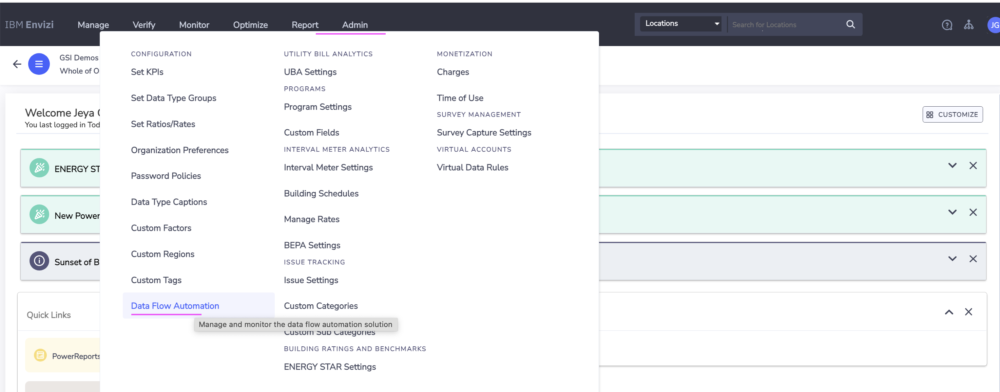

    The Data services page is opened.

2. Click on `Add New Service`

    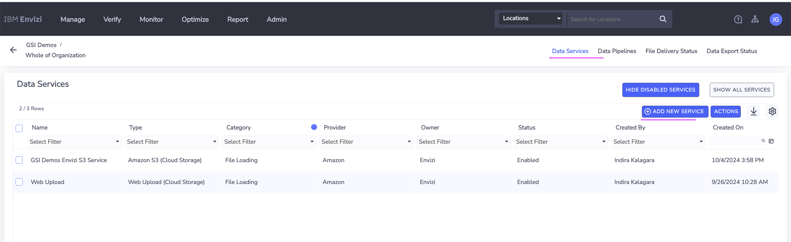

3. Enter the following.

    - Category : `Data Export`
    - Type : `Amazon S3 ...`
    - Onwer : `Envizi`
    - Name : Enter any name

4. Click on `Save`

    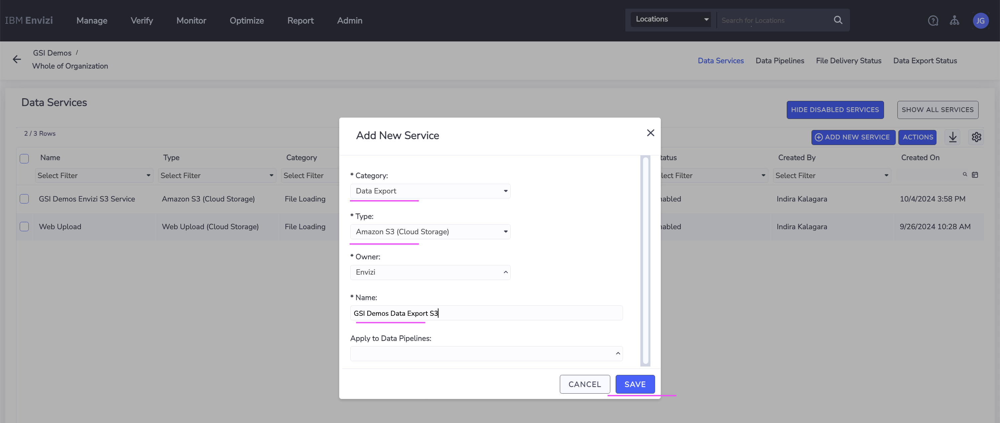

    The Data service is created.

    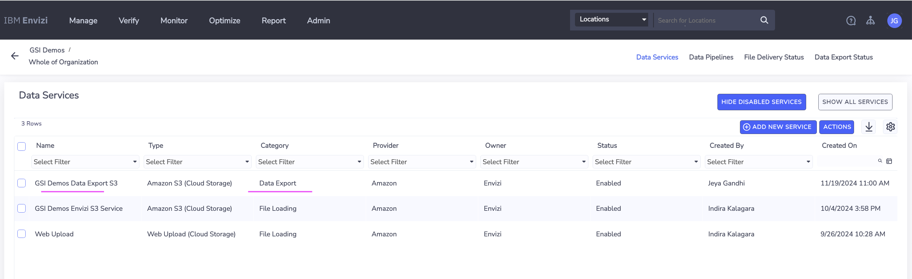

5. Open the Data Services by clicking  `Actions > Manage Connections`

    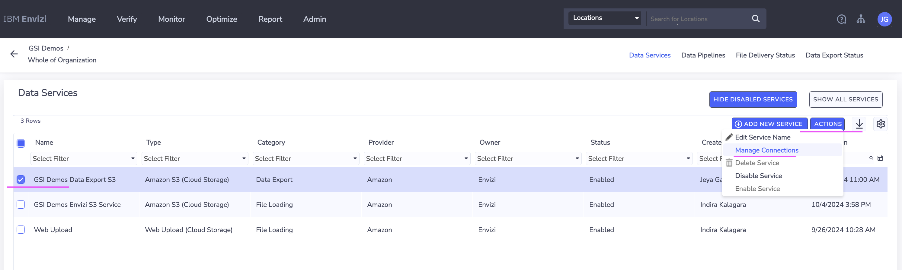

    The `Manage Connections` page of the data service is opened.

    


6. Click on  `Actions >  Create/Reset Access Key`

    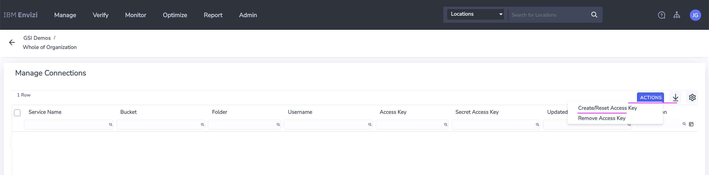

7. Copy the `Secret Access Key` in a text file

8. Click on  `Save`

    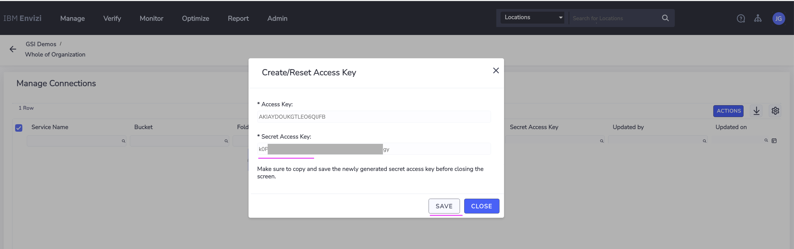

    The connection is created.

9. Note down the values of the following in a text file
    - Bucket 
    - Folder
    - UserName
    - Access Key

    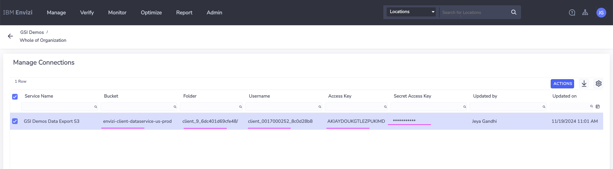


## 2. Create Data Pipeline

Need to create Data pipeline to download Monthly Data Set from the Envizi into S3 bucket. 

1. Open the Data Pipeline by clicking  `Data pipelines` from the top links.

    The Data pipelines page is displayed.

2. Click on `Add New Pipeline`

    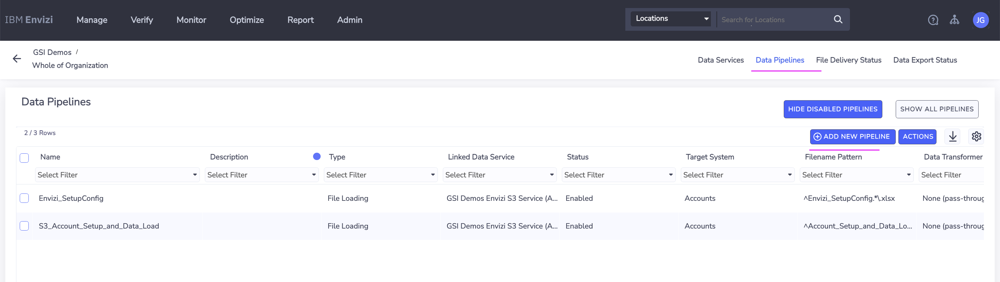

3. Enter the following.

    - Name : Enter any value
    - Type : `Data Export`
    - Data Set : `Monthly DataSet`
    - Destination : Choose the above created Data Services name.

4. Click on `Save`

    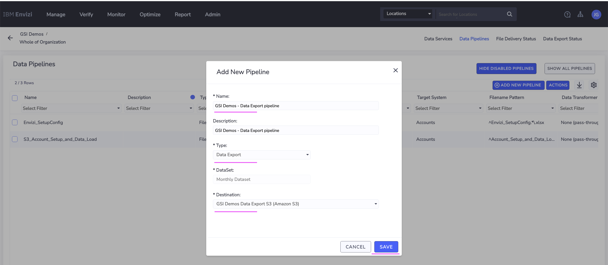

    The Data pipeline is created.

    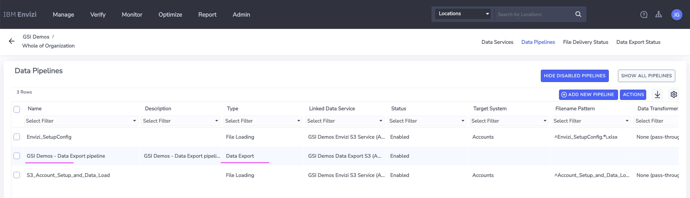

## 3. Data Export Status

After a while the data should be created and available in the S3 Bucket. You can see the status of that here.

1. Click on the  `Data Export Status` from the top links.

    The Data Export Status page is displayed.

    It shows the Monthly Data set is automatically downloaded and available in the S3 bucket.

    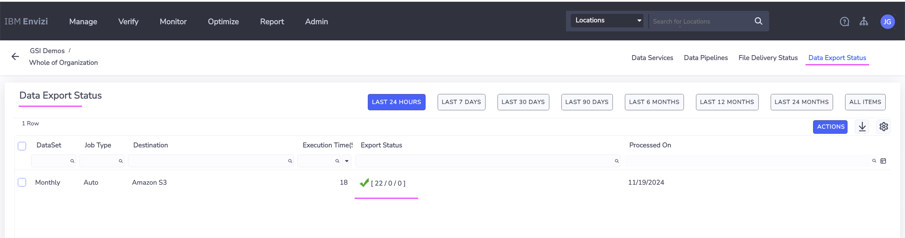


## 4. Downloading the data from S3

Let's use the sample python script [main.py](./python/main.py) to download the [monthly data set files](./output) from S3 bucket now. 

1. Download the `main.py` file into a folder.

2. Open the linux/mac terminal window and goto folder where you downloaded the `main.py` file.

3. Instal the `boto3` for python if it is not available in your system.
    ```
    python -m pip install boto3
    ```

4. Run the below command with your S3 Data service values.
    ```
    export s3_BUCKET_NAME=envizi-client-dataservice-us-prod
    export s3_FOLDER_NAME=client_9608cd600af647/
    export s3_ACCESS_KEY=AKIxxxxxxxxxxxxxxx
    export s3_SECRET_KEY=axhHxxxxxxxxxxxxxx

    ```
5. Run the below command to download the files from S3.
    ```
    python main.py
    ```

    you may get the output like this..

    ```
    Download start......
    s3_BUCKET_NAME : envizi-client-dataservice-us-prod
    s3_FOLDER_NAME : client_9_6dc401d69cfe48/
    s3_client created  ...
    Downloading files from folder 'client_9_6dc401d69cfe48/' ...
    Downloading: client_9_6dc401d69cfe48/powerbiConversionFactors_GSIDemos_19Nov2024.csv -> ./downloaded_files/powerbiConversionFactors_GSIDemos_19Nov2024.csv
    Downloading: client_9_6dc401d69cfe48/powerbiConversion_GSIDemos_19Nov2024.csv -> ./downloaded_files/powerbiConversion_GSIDemos_19Nov2024.csv
    Downloading: client_9_6dc401d69cfe48/powerbiCurrency_GSIDemos_19Nov2024.csv -> ./downloaded_files/powerbiCurrency_GSIDemos_19Nov2024.csv
    ```

6. Goto to the folder `./downloaded_files`and see the monthly  dataset files downloaded from the S3.

7. The sample monthly data set files are available [here](./output). 
